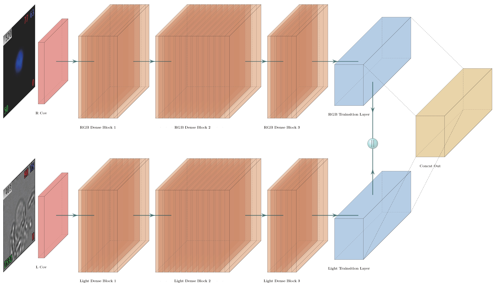

# ACPM Installation

<div align='center' ><b><font size='150'>Overview of ACPM</font></b></div>
  


For instructions on installing anaconda on your machine (download the distribution that comes with python 3):
https://www.anaconda.com/distribution/

Next, use the environment configuration file located in **docs/ACPM.yaml** to create a conda environment:

**It will take several minutes or hours depending on the speed of the network. Please be patient.**

```shell
conda env create -n acmp -f docs/ACPM.yaml
```

Activate the environment:

```shell
conda activate acmp
```

When done running experiments, to deactivate the environment:

```shell
conda deactivate acmp
```


ACPM Reproduce
===========

Set your step_01_configs : `configs/Data_prepare_config.yaml` , Tips about configuration file editing is already written in the configuration file

__Attention, image must be stored as follow:__

```
#=============================================================================
# data_root_dir Structure:
# ├── 210223001
# │   ├── Positive_CTC
# │   │   ├── 210223001.1-152.B.TIF
# │   │   ├── 210223001.1-152.C.TIF
# │   │   ├── 210223001.1-152.G.TIF
# │   │   ├── 210223001.1-152.RGB.TIF
# │   ├── CD-CK++
# │   │   ├── 210223001.111-129.B.JPG
# │   │   ├── 210223001.97-110.G.JPG
# │   │   ├── 210223001.97-110.RGB.JPG
# │   │   └── 210223001.97-110.R.JPG
# ============================================================================
```

Set your step_02_configs : `configs/Train_loop_config.yaml` , Tips about configuration file editing is already written in the configuration file


ACPM Use To Predict CTCs
===========

First, use `configs/Data_prepare_config.yaml` , to get images H5_file  ( image stored must like above ).

Second, set the `Eval_config.yaml`

Last, Run `Eval_CTC.py`

If you encounter any problems during the experiments that you do not understand (after a thorough consideration), you can contact me via the following ways:

```
School of Basic Medical Sciences,
Fujian Medical University,
Fuzhou, Fujian, China.
please contact with me via the following ways:
(a) e-mail :yuansh3354@163.com

---------------------------------------
Best Regards,
Yuan.SH
---------------------------------------
```

